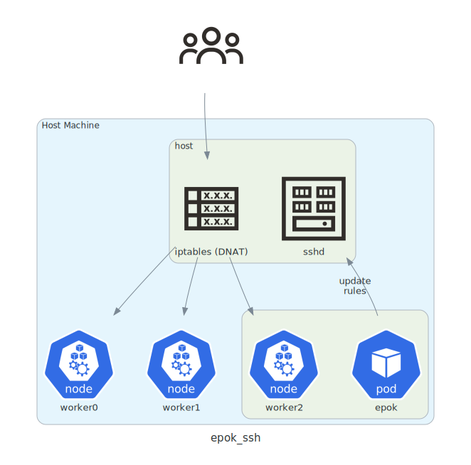

# Epok

Epok is an external port operator for self-hosted Kubernetes clusters. 

It exists mainly because:

* I wanted to get some experience writing Kubernetes operators using Rust.
* I'm operating a couple of homelab Kubernetes clusters where Kubernetes nodes 
run as virtualized workloads (LXC containers or VMs) on a single host machine.
* I needed a way to transparently forward traffic from the host machine to
`NodePort`-type services "residing" on the worker nodes.

Epok can be deployed either directly on the host machine, or inside the cluster
itself. If deployed inside the cluster it will need a way to communicate with
the host machine in order to alter its `iptables` rules. See the section on 
using the [SSH Executor](#ssh-executor) for details.

## Usage

To function correctly, Epok needs to know which interfaces on the host machine
to forward traffic from. This is specified via the `-i` or `--interfaces` CLI
option.

It also needs to know which executor to use:

* `local` when deployed on the host machine
* `ssh` when deployed inside the cluster

```
epok [OPTIONS] --interfaces <INTERFACES> <EXECUTOR>

OPTIONS:
    -i, --interfaces <INTERFACES>
            Comma-separated list of interfaces to forward packets from [env: EPOK_INTERFACES=]

        --external-interface <EXTERNAL_INTERFACE>
            Internal services won't be reachable through this interface [env: EPOK_EXTERNAL_INTERFACE=]

        --batch-commands <batch-commands>
            Batch the execution of iptables commands [env: EPOK_BATCH_COMMANDS=] [default: true]

        --batch-size <BATCH_SIZE>
            Maximum command batch size [env: EPOK_BATCH_SIZE=] [default: 1677722]

    -h, --help
            Print help information

    -V, --version
            Print version information

EXECUTORS:
    local    Execute commands locally - use this executor when running epok directly on the host machine
    ssh      Execute commands through ssh - use this executor when running epok inside the Kubernetes cluster
```

## Annotations & labels

Annotations namespaced under `epok.getbetter.ro` can be used to tell Epok about 
Kubernetes services and nodes it should (or shouldn't) take into account.

Services can be annotated with:

* `epok.getbetter.ro/externalports` - use this on a `NodePort`-type service
to tell Epok which ports it should forward. It expects a comma-separated list
of port mappings. For example: `epok.getbetter.ro/externalports: 22:2022,25:2025`.
Single port mappings are supported - just omit the comma. UDP is supported by 
suffixing the mapping with `:udp` - for example: `epok.getbetter.ro/externalports: 53:8053:udp`
* `epok.getbetter.ro/internal` - tells Epok that this is an "internal" service.
If an external interface has been specified (via the `--external-interface` option)
Epok will _not_ allow the service to be reachable from it. Useful for when 
you're connecting to the host machine via a VPN tunnel and want certain services
to be reachable only through the tunnel.
* `epok.getbetter.ro/allow-range` - CIDR range of IPv4 addresses allowed to talk 
to the service

Nodes can be excluded from the ruleset by:

* using the `epok.getbetter.ro/exclude` annotation with any value
* using the `epok_exclude` label

## SSH Executor

When deployed inside the cluster, Epok needs a way to communicate to the host
machine in order to update the `iptables` ruleset. The simplest solution I 
could conjure was to simply set up a dedicated user account on the host
that can only manipulate `iptables` rules and use SSH to connect.

<p align="center">
  
</p>

Here's one way to do it:

```shell
export EPOK_USER=epok

# create the user
sudo useradd --create-home $EPOK_USER; sudo passwd -d $EPOK_USER

# restrict the epok user to iptables + iptables-save commands
echo "%${EPOK_USER} ALL=(ALL) NOPASSWD: /usr/sbin/iptables, /usr/sbin/iptables-save" \
  | sudo EDITOR='tee' VISUAL='tee' visudo -f /etc/sudoers.d/$EPOK_USER

# create and authorize an SSH key
sudo su $EPOK_USER -c ssh-keygen
sudo mv /home/$EPOK_USER/.ssh/id_rsa.pub /home/$EPOK_USER/.ssh/authorized_keys 

# grab the private key and store it in a safe place
sudo mv /home/$EPOK_USER/.ssh/id_rsa /path/to/private.key
```

NOTE: [`sealedsecrets`](https://github.com/bitnami-labs/sealed-secrets) is a good solution for storing the private key inside the cluster.

To test connectivity:

```shell
epok -i eth0 ssh --host $EPOK_USER@host_machine --key /path/to/private.key
```

## Deployment example

Requirements:

* [`just`](https://github.com/casey/just)
* `envsubst` - usually found within the `gettext` package of your distro

Create a build + deploy configuration file:

```shell
cat > epok.config <<EOF
# Where should we push the container image? Should be reachable from the cluster.
EPOK_IMAGE="my.docker.registry/epok:latest"

# What interfaces should we forward packets from?
EPOK_INTERFACES="eth0"

# What SSH user@host should we use to connect to the host machine?
EPOK_SSH_HOST=epok@10.0.0.1

# On what port is sshd listening on the host machine?
EPOK_SSH_PORT=22222

# What private key should we use to authenticate?
EPOK_SSH_KEY=/path/to/private.key

# What namespace shall we deploy to?
EPOK_NS=epok

export EPOK_IMAGE EPOK_INTERFACE EPOK_SSH_HOST EPOK_SSH_PORT EPOK_SSH_KEY EPOK_NS
EOF
```

Build Epok & the container image and push it to the registry:

```shell
source epok.config
just docker-release docker push
```

Create the namespace and secret, then deploy using the supplied
[example manifests](docs/deployment-example.yaml):

```shell
source epok.config
kubectl create ns $EPOK_NS
kubectl create secret -n $EPOK_NS generic epok-ssh \
  --from-file=id_rsa=$EPOK_SSH_KEY \
  --from-literal=ssh_host=$EPOK_SSH_HOST \
  --from-literal=ssh_port=$EPOK_SSH_PORT
envsubst < docs/deployment-example.yaml | kubectl apply -f -
```
